# IT-Ticketing-System-Simulation

## Project Overview
This Jira IT Ticketing System Lab was developed to gain practical experience handling common Tier 1 IT support scenarios. This project focuses on using Jira Service Management to manage incoming support tickets, communicate with end users, record troubleshooting procedures, resolve technical problems, and escalate incidents to the appropriate teams when necessary.

---

## Technologies Used
- Jira Service Management

---

## Lab Simulation

### IT Support Queue:

**Created a simulated queue containing 5 common IT support tickets.**

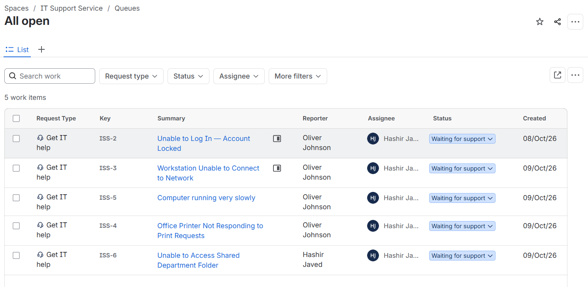

---

### Account lockout ticket

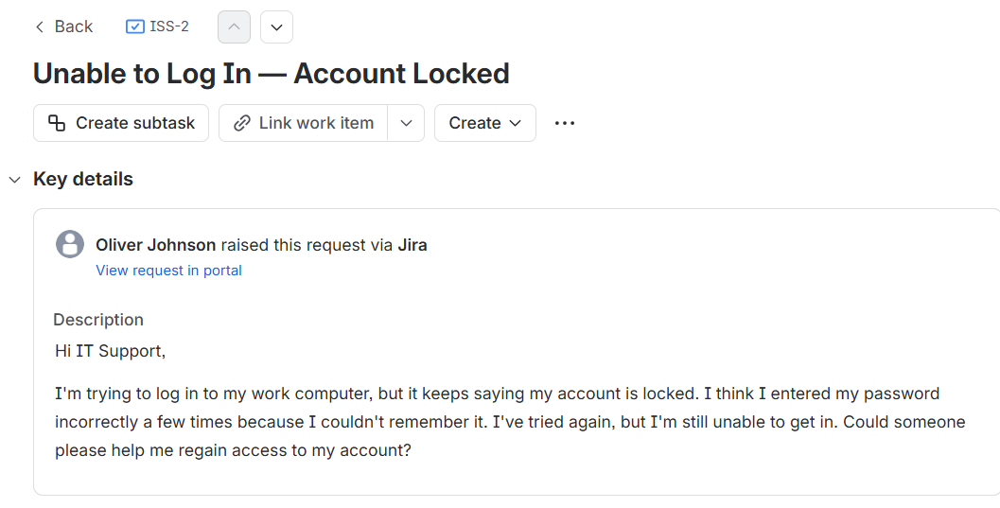
 *Ticket submitted by user*

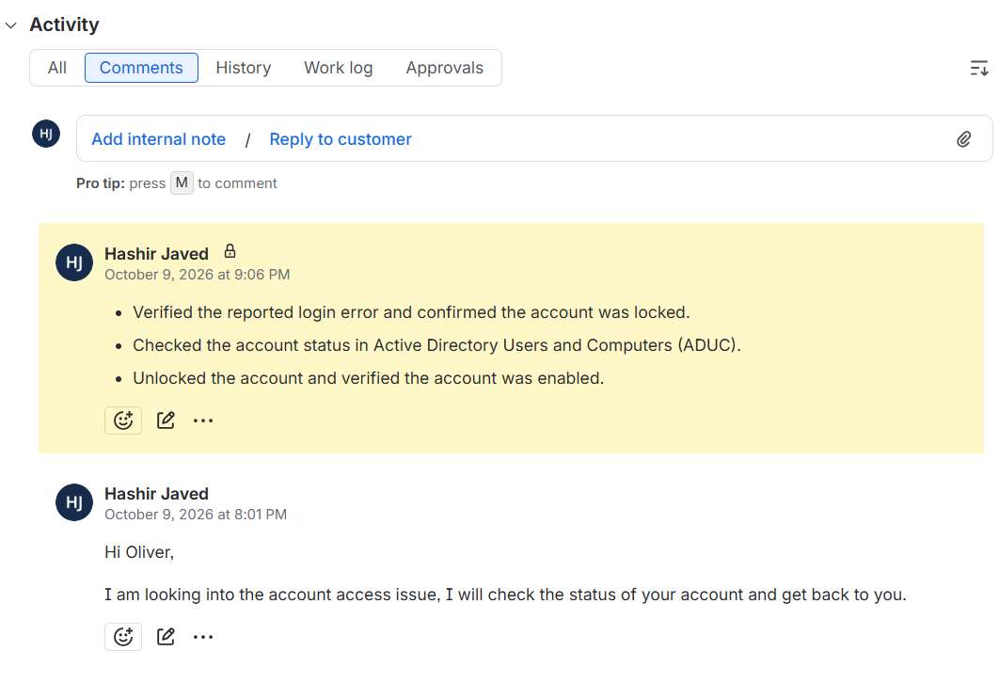
 *Troubleshooting steps and user communication documented*

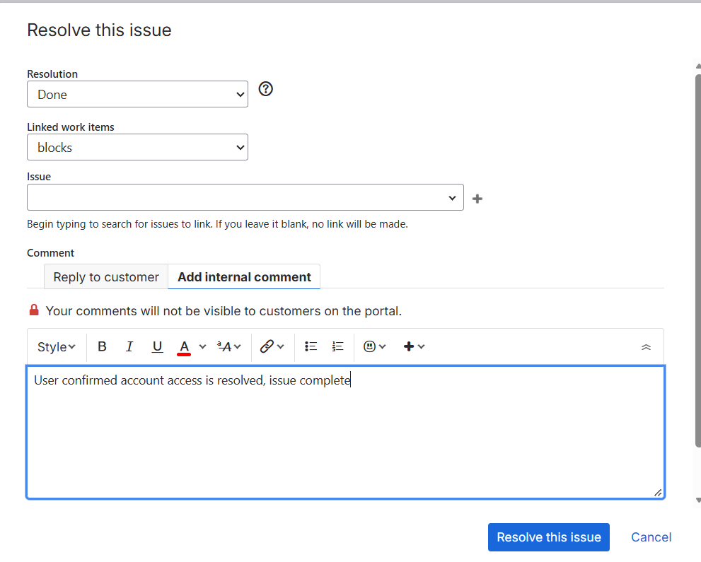
 *Ticket closed*

---

### Network connectivity ticket

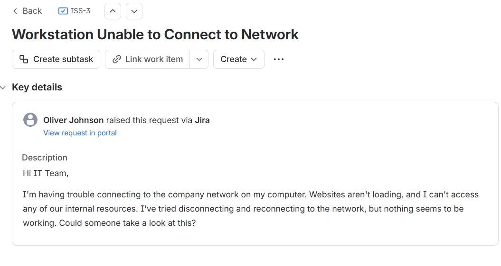
 *Ticket submitted by user*

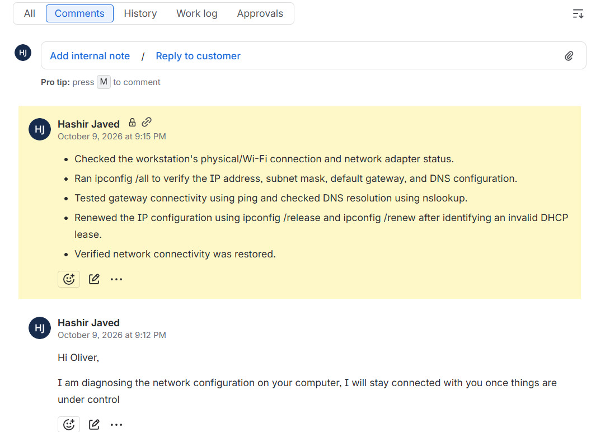
 *Troubleshooting steps and user communication documented*

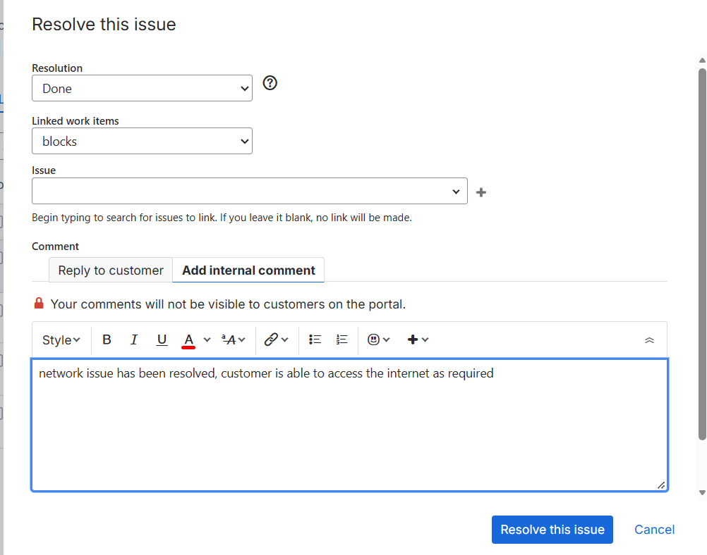
 *Ticket closed*

---

### Slow workstation ticket

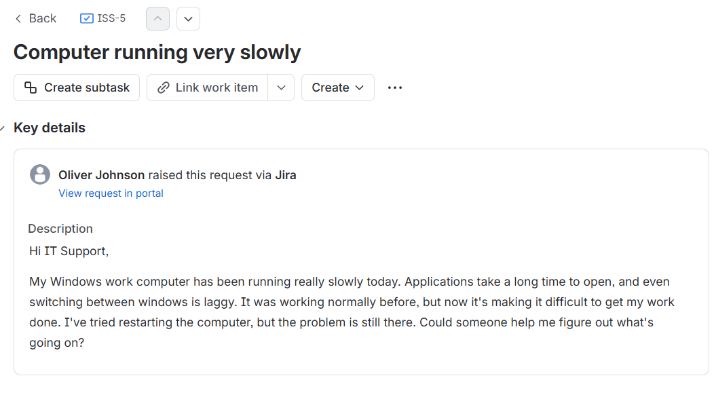
 *Ticket submitted by user*

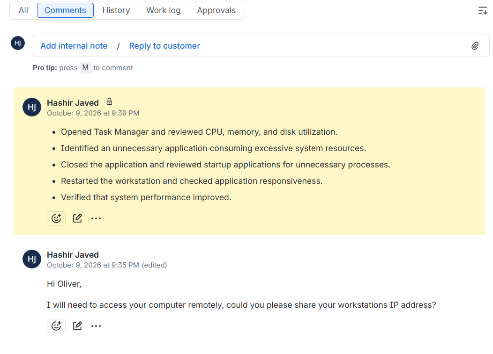
 *Troubleshooting steps and user communication documented*

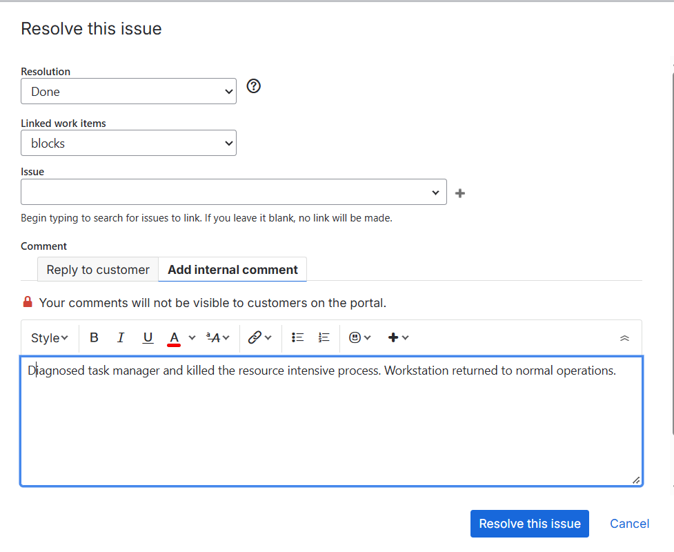
 *Ticket closed*

---

### Printer issue ticket

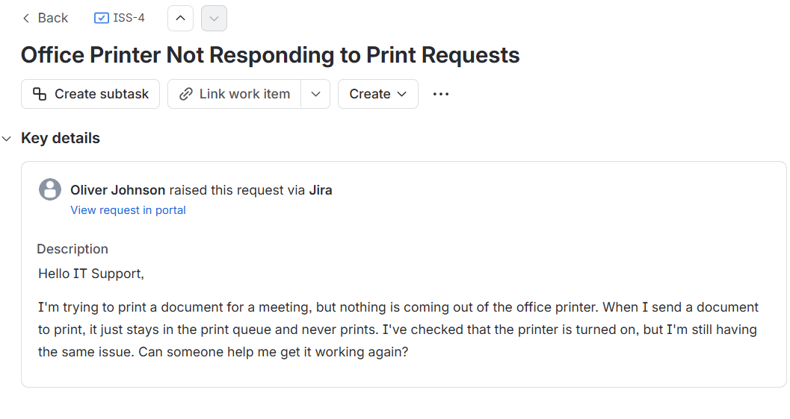
 *Ticket submitted by user*

 *Troubleshooting steps and user communication documented*

 *Ticket closed*

---

### Shared foler access ticket

 *Ticket submitted by user*

 *Troubleshooting steps and user communication documented*

 *Ticket escalated*

---

## Skills Learned

- Jira ticket creation and management

- Ticket prioritization and queue management

- Tier 1 IT troubleshooting

- Customer communication and internal notes

- Ticket resolution and escalation

